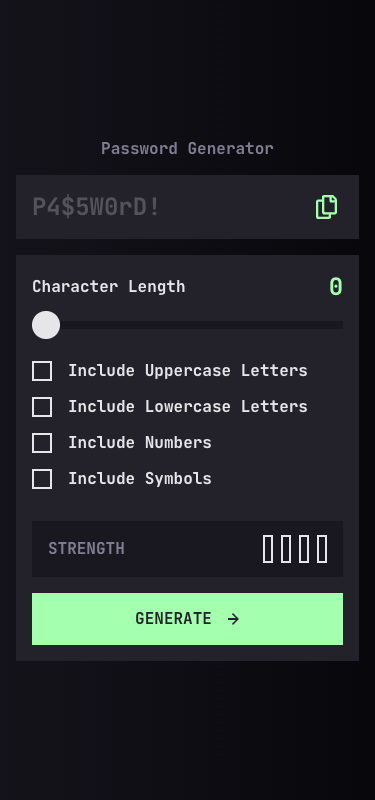
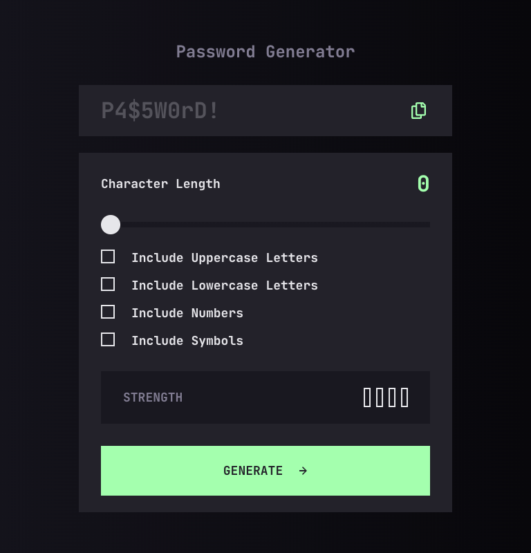
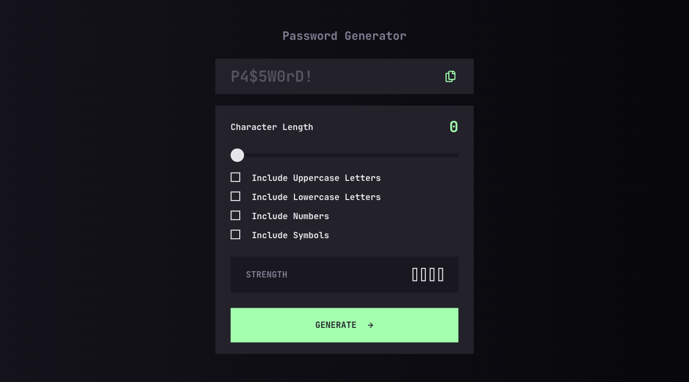
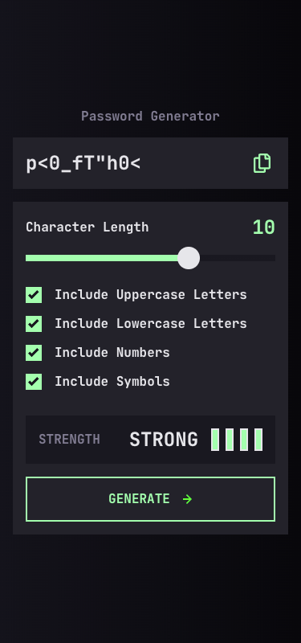
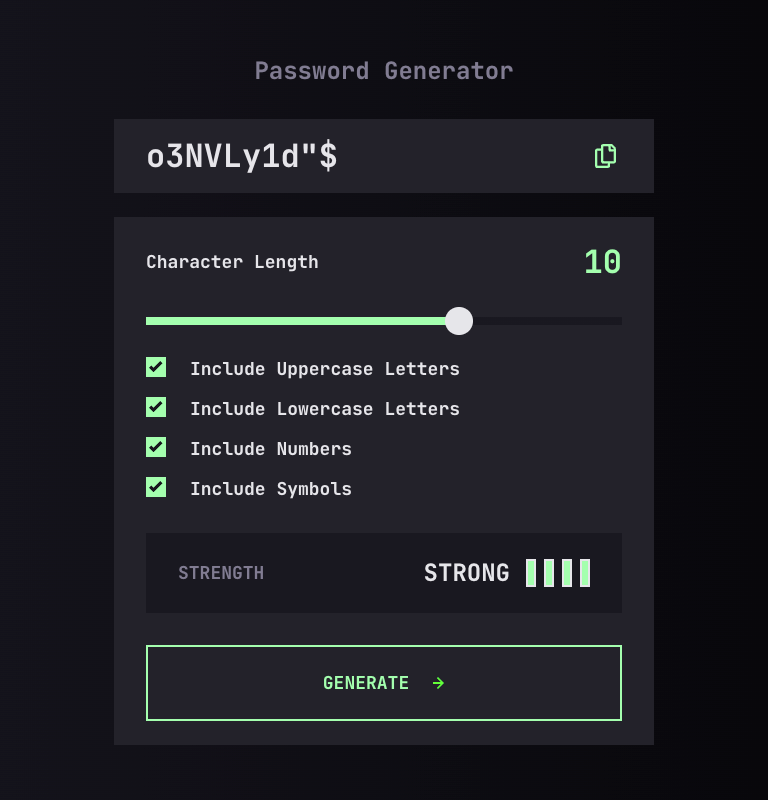
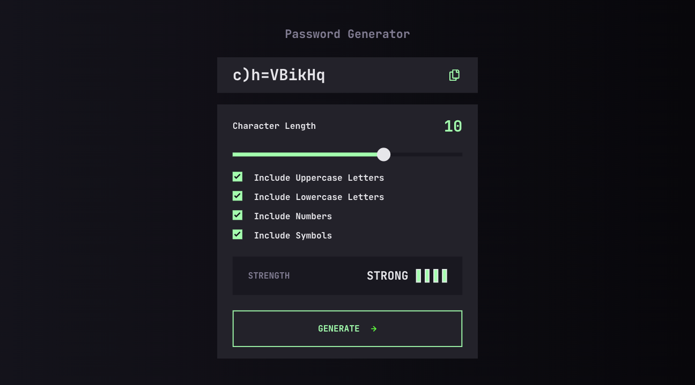
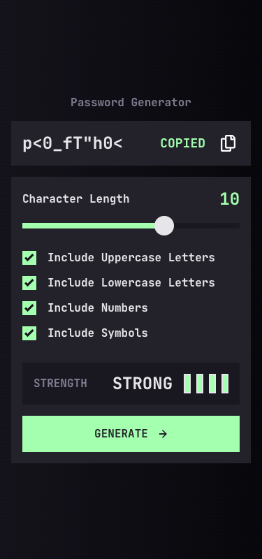
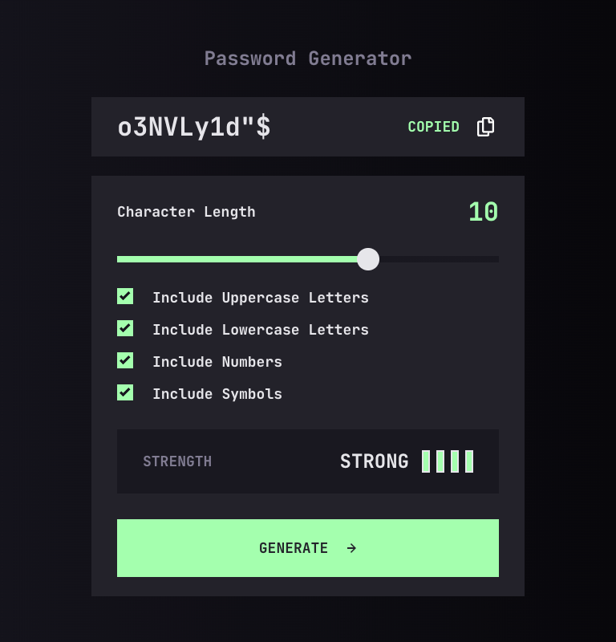
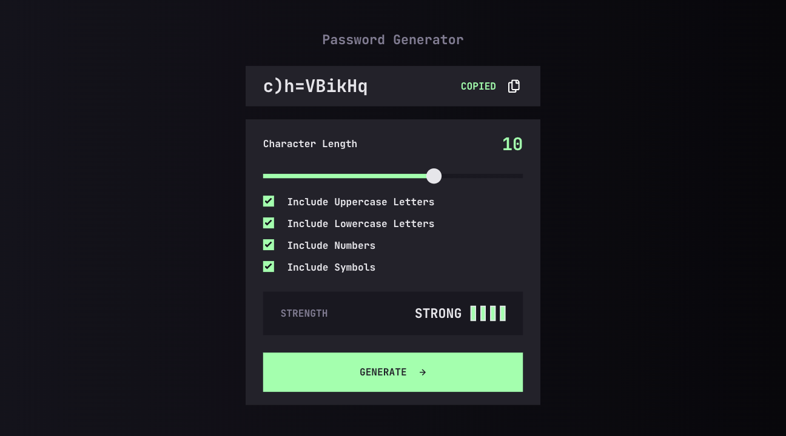

# 🔐 Password Generator App

A secure and responsive password creation tool featuring dynamic length control 📏, customizable security filters (uppercase, lowercase, numbers, symbols) 🛠️, a real-time password strength estimator 💪, and a seamless one-click copy to clipboard functionality ✨.

## Overview

This project was developed as a high-fidelity implementation of a Figma design 🎨, focusing on creating a secure and highly interactive password generation interface that remains consistent across mobile 📱, tablet 📲, and desktop 💻 environments.

Key focus areas included building a robust CSS architecture 🏗️ to handle the complex slider and custom checkbox styling, implementing a real-time strength assessment algorithm 🛡️ to provide immediate visual feedback, and employing JavaScript DOM manipulation ⚡ to generate cryptographically varied strings based on specific user-defined constraints 📄.

## 🔗 Live Demo

## 🎨 Visual Design

| State 🎛️    | Mobile 📱                                             | Tablet 📲                                             | Desktop 💻                                             |
| :---------- | :---------------------------------------------------- | :---------------------------------------------------- | :----------------------------------------------------- |
| **Default** |  |  |  |
| **Strong**  |   |   |   |
| **Copied**  |   |   |   |

## 🎯 The Challenge

The challenge was to build out this **Password Generator App** 🔐 and get it looking as close to the design as possible, ensuring the generation logic was cryptographically osund and the UI remained highly responsive.

### 🧑‍💻 Users should be able to:

- 🏗️ Generate a **secure password** based on specific inclusion options (uppercase, lowercase, numbers, and symbols).

- 📋 Copy the generated password to the computer's **clipboard** with immediate visual confirmation.

- 🛡️ See a real-time **strength rating** for their generated password to ensure maximum security.

- 📱 View the optimal layout for the interface depending on their device's screen size.

- 🖱️ See **hover and focus states** for all interactive elements, including the range slider and custom checkboxes.

## 🛠️ Built with

## 🚀 Features

- 🔑 **Dynamic Password Generation:** Instantly creates secure, randomized strings based on user-selected criteria (uppercase, lowercase, numbers, and symbols).

- 🎛️ **Precision Length Control:** Features a custom-styled range slider that allows users to define the exact character count with real-time feedback.

- 🛡️ **Strength Estimation:** Includes a visual security meter that evaluates password complexity in real-time, providing immediate feedback on how safe your password is.

- 📋 **Instant Clipboard Access:** Implements a seamless "one-click" copy functionality with visual success confirmation to streamline the user workflow.

- 📐 **Responsive Architecture:** Built with a mobile-first approach using CSS Flexbox to ensure a pixel-perfect experience on any device.

- ✨ **Polished User Experience:** Features custom-styled checkboxes and interactive hover/states, maintaining high-fidelity to the original design.

## 👤 Author

**Christian Diaz**

- 💼 LinkedIn - [Christian Diaz](https://www.linkedin.com/in/chris-diazasc/)
- 👾 Frontend Mentor - [@chrisdzasc](https://www.frontendmentor.io/profile/chrisdzasc)
- 🧩 Frontend Mentor Solution - [🔐 Responsive Password Generator with Real-Time Strength Validation ✨](https://www.frontendmentor.io/solutions/-responsive-password-generator-with-real-time-strength-validation-wYrH3Dx6Ju)
